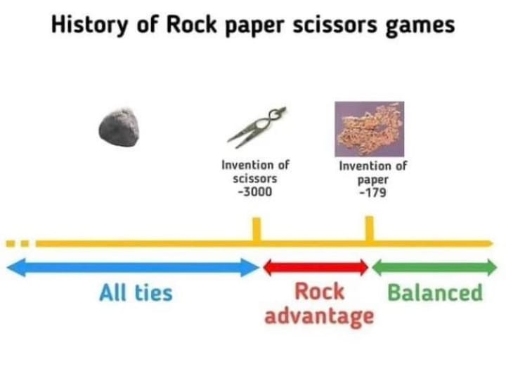

# Juego de Piedra, Papel o Tijera

¡Bienvenido al Juego de Piedra, Papel o Tijera! En este juego clásico, tendrás la oportunidad de competir contra la computadora en una serie de rondas. ¿Tienes lo que se necesita para ganar al mejor de 5 intentos? ¡Descúbrelo ahora!

# Breve Historia del Piedra, Papel o Tijera

 

## Cómo Jugar

1. Ingresa tu nombre en el campo de texto proporcionado.
2. Elige tu movimiento: Piedra, Papel o Tijera haciendo clic en los botones correspondientes.
3. La computadora elegirá su movimiento al azar.
4. Descubre quién ganó la ronda y el resultado se mostrará en la pantalla.
5. Se llevará un seguimiento del marcador para ti y la computadora.
6. El juego continúa hasta que uno de los jugadores alcance 3 puntos o hasta que se jueguen 5 rondas.
7. ¡El jugador con más puntos al final gana el juego!

## Implementación

Este juego está implementado utilizando React, una popular biblioteca de JavaScript para construir interfaces de usuario. A continuación, se describen algunos detalles clave de la implementación:

- **Componentes React**: El juego se divide en componentes de React para una organización y reutilización efectivas del código.
- **Styled Components**: Los estilos CSS se aplican utilizando Styled Components, lo que permite una gestión más eficiente y mantenible de los estilos.
- **Manejo de Estado**: Se utiliza el estado de React para realizar un seguimiento de la puntuación del jugador y la computadora, el nombre del jugador y el progreso del juego.
- **Lógica de Juego**: Se ha implementado la lógica del juego para determinar al ganador de cada ronda y el ganador del juego en función de las reglas de Piedra, Papel o Tijera.
- **Finalización del Juego**: El juego finaliza cuando uno de los jugadores alcanza 3 puntos o después de 5 rondas, y se muestra un mensaje del ganador.

## Ejecución

Para ejecutar el juego en tu entorno local, sigue estos pasos:

1. Clona este repositorio en tu computadora.
2. Abre una terminal en la carpeta raíz del proyecto.
3. Ejecuta `npm install` para instalar las dependencias.
4. Ejecuta `npm start` para iniciar la aplicación.
5. Abre tu navegador web y ve a `http://localhost:3000`.

¡Diviértete jugando al Piedra, Papel o Tijera!

## Autor

Este juego fue creado por Mariano Llanes como proyecto de aprendizaje de React, enmarcado en el Curso de Programacion Web Front-End, como respuesta al Practico n°3.

Si tienes alguna pregunta o comentario, no dudes en ponerte en contacto conmigo.